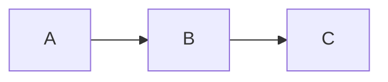
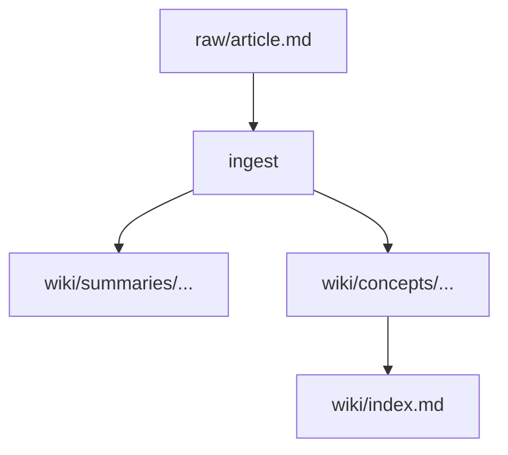
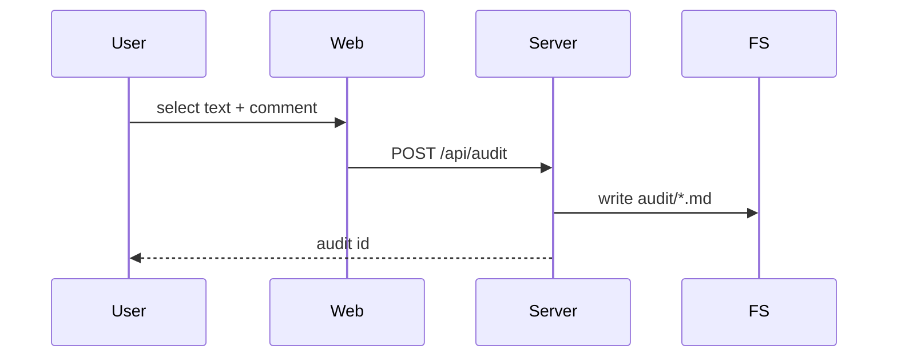
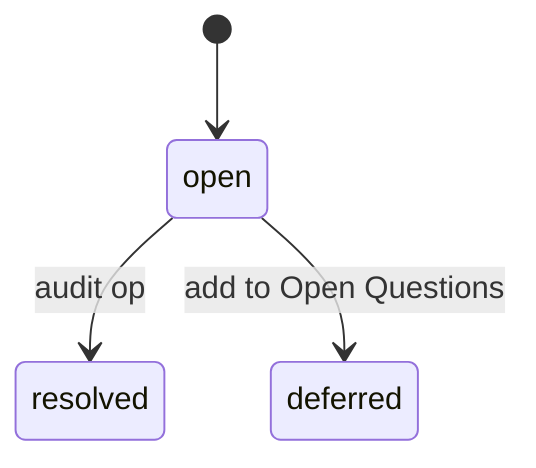

# Wiki Article Writing Guide

Guidelines for writing high-quality wiki articles. Read before compiling a new concept or entity page.

## Length targets

| Page type | Target length | Notes |
|-----------|--------------|-------|
| Concept page | 400–1200 words | Dense, no padding. **Hard ceiling: 1200.** |
| Folder-split `index.md` | 150–400 words | Definition + map of sub-pages |
| Sub-page under a folder-split | 400–1200 words | Covers one aspect |
| Entity page | 200–500 words | Factual, link-heavy |
| Summary page | 150–400 words | Takeaways, not a rewrite |

Avoid padding. A 400-word article that's dense beats an 800-word article with filler.

## Divide and conquer — when to split

If a concept page **would** exceed ~1200 words, do not write it as a single file. Split it:

1. Create `wiki/concepts/<topic>/`.
2. Write `wiki/concepts/<topic>/index.md`:
   ```markdown
   ---
   title: <Topic>
   type: concept
   ...
   ---

   # <Topic>

   <One-sentence definition.>

   ## What it is

   <150–300 words of overview.>

   ## Sub-pages

   - [[<Topic>/<aspect-1>]] — <one-line summary>
   - [[<Topic>/<aspect-2>]] — <one-line summary>
   - ...

   ## Sources

   - [[summaries/...]]
   ```
3. Write each `<aspect-N>.md` as a focused 400–1200 word page.
4. Update `wiki/index.md` to show the hierarchy with indented bullets under the folder-split entry.

Signs a page needs to be split:
- Word count creeping past 1000.
- Three or more `##` top-level sections, each with its own `###` subsections.
- Multiple distinct concepts mentioned but not explored because there's no room.
- You find yourself wanting to link to a specific section with `[[Page#Section]]` — that section probably deserves its own page.

## Concept page structure

```markdown
---
title: <Title>
type: concept
created: YYYY-MM-DD
updated: YYYY-MM-DD
sources: [slug1, slug2]
tags: [tag1, tag2]
---

# <Title>

<One-sentence definition or core idea.>

## What it is

<Explain the concept clearly. Assume the reader is technically literate but unfamiliar with this specific topic.>

## How it works

<Mechanism, process, or structure. Use a mermaid diagram if it's a flow, sequence, hierarchy, or state.>



## Key properties / tradeoffs

<Bullet list or short paragraphs. Use KaTeX for any formula — inline `$...$` or block `$$...$$`.>

## Relationship to other concepts

- [[Related Concept A]] — how they relate
- [[Related Concept B]] — contrast or connection

## Open questions

<What this wiki doesn't yet know about this concept. Drives future ingest.>

## Sources

- [[summaries/source-slug-1]] — (date) one-line description
- [[summaries/source-slug-2]] — (date) one-line description
```

## Entity page structure

```markdown
---
title: <Name>
type: entity
entity_type: person | tool | paper | organization
created: YYYY-MM-DD
updated: YYYY-MM-DD
sources: [slug1]
tags: [tag1]
---

# <Name>

<One-sentence description.>

## Key contributions / features

<What this entity is known for in the context of this wiki's topic.>

## Related concepts

- [[Concept A]] — connection

## Sources

- [[summaries/source-slug]]
```

## Summary page structure

Summaries are concise representations of a single source. They are not rewrites.

```markdown
---
title: summaries/<slug>
type: summary
source_url: https://...
source_type: article | paper | gist | video | podcast | ref
date: YYYY-MM-DD
ingested: YYYY-MM-DD
tags: [tag1]
---

# <Source Title>

**Source**: [<Author/Org>](<URL>) · <date>

## Key takeaways

- <Most important insight 1>
- <Most important insight 2>
- <Most important insight 3>

## Core claims

<2–4 sentences on the main argument or findings.>

## Notable quotes

> "<exact quote>" — <attribution>

## Concepts introduced / referenced

- [[Concept A]]
- [[Entity B]]
```

## Diagrams — always mermaid

ASCII art is banned. Any flow, sequence, hierarchy, or state diagram is mermaid. Examples:

Flow:
````markdown

````

Sequence:
````markdown

````

State:
````markdown

````

## Formulas — always KaTeX

Inline: `The loss is $\mathcal{L}(\theta) = \sum_i \ell(f_\theta(x_i), y_i)$.`

Block:
```markdown
$$
\mathcal{L}(\theta) = \frac{1}{N}\sum_{i=1}^{N} \ell\bigl(f_\theta(x_i), y_i\bigr) + \lambda \|\theta\|_2^2
$$
```

The web viewer renders math server-side with KaTeX. Obsidian renders it natively.

## Wikilink rules

1. **Link first mention** of every entity or concept — don't wait for "a natural place".
2. **Link maximum twice per article** — don't over-link the same page.
3. **Link concepts that exist** — check `wiki/index.md` before creating a new link target.
4. **For folder-split pages**, link the index with an alias: `[[concepts/Foo/index|Foo]]`.
5. **Backlink audit** — after writing a new article, grep existing articles for the new page's title and add incoming links.

## Handling contradictions between sources

When two sources contradict each other:

1. State both claims explicitly.
2. Note which source supports each claim.
3. Add to the article's "Open questions" section **and** the wiki's `CLAUDE.md` research questions.
4. Do NOT silently pick one — contradictions are valuable signal.

Example:
> Source A (2024) claims X. Source B (2026) claims Y, which contradicts A. It's unclear whether this reflects a methodological difference or an error in one source. See [[summaries/source-a]] and [[summaries/source-b]].

If a human later files an `audit` comment resolving the contradiction, update the article and move the audit to `audit/resolved/` with a resolution note.

## Incorporating audit feedback

When processing an open audit that targets an article you're editing:

1. Locate the anchor using `anchor_before` / `anchor_text` / `anchor_after`.
2. Apply the correction in the smallest edit that fixes the issue.
3. Bump the `updated:` field in the frontmatter.
4. Add a line to the `# Resolution` section of the audit file explaining what changed.
5. Move the audit file to `audit/resolved/`.
6. Log the resolution under the current day's `log/YYYYMMDD.md`.

