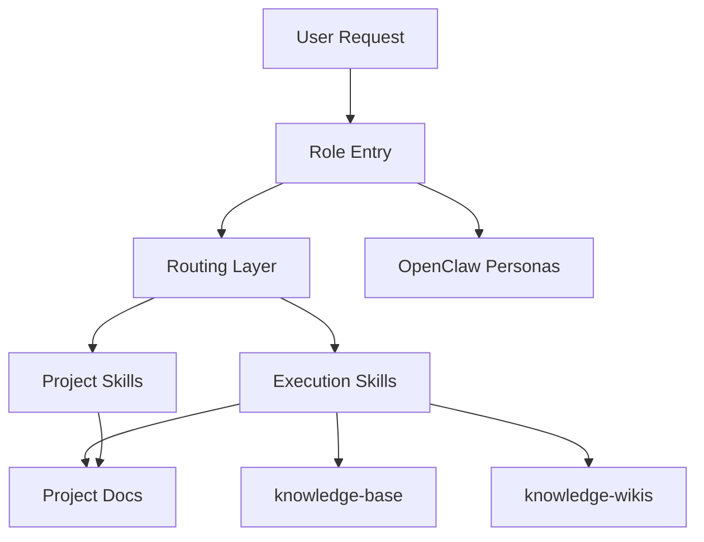

# Local Agent Stack

## Summary

当前本地系统不是单一 Agent 框架，而是一个混合栈：

- `Claude commands` 负责角色入口
- `OpenClaw agents` 负责人格与工作手册
- `global/project skills` 负责具体执行工作流
- `Hindsight + knowledge-base` 负责长期记忆
- `llm-wiki + knowledge-wikis` 负责结构化研究知识
- `Hermes-style routing layer` 负责在执行前做角色路由、记忆分层和技能沉淀判断

这套结构的目标不是“统一到一个工具里”，而是让不同层各司其职，同时减少职责重叠。

## Layer Model

## 1. Role Entry Layer

角色入口在 `~/.claude/commands/`，当前主要包括：

- `dev`
- `pm`
- `ui`
- `arch`
- `ba`
- `sm`

这些入口的职责是定义**主视角**，而不是包办所有动作。  
它们会先判断这次任务是否真的属于当前角色，再决定是否需要拉上其他角色提供辅助视角。

对应的人格与方法论资产位于 `~/.openclaw/agents/*/agent/`，主要由：

- `SOUL.md`
- `AGENTS.md`
- `IDENTITY.md`

构成。

## 2. Routing Layer

Routing layer 是这套系统吸收 Hermes Agent 思路后新增的关键层。

当前包含：

- `hermes-loop`
- `research-routing`
- `productivity-routing`
- `knowledge-routing`
- `agent-architecture-routing`

这一层的目标是：**先分类，再执行。**

它解决的问题包括：

- 某个请求到底应该交给哪个角色主导
- 应该用全局 skill 还是项目私有 skill
- 信息应该写进项目文档、`knowledge-base`，还是 `knowledge-wikis`
- 某个重复动作是否已经值得沉淀成新 skill

与 Hermes Agent 的关系是：

- Hermes 把 routing、memory、skills、cron 视为统一 runtime
- 本地系统目前没有完全替换为 Hermes，而是把 Hermes 的 routing 思路移植到了现有框架上

## 3. Execution Skills Layer

执行技能层分为全局和项目私有两类。

### Global Skills

当前主要包括：

- `solo-toolkit`
- `llm-wiki`

其中：

- `solo-toolkit` 偏设计、前端、产品实现与评审
- `llm-wiki` 偏结构化主题知识库编译

### Project Skills

项目私有 skills 位于各仓库的 `.claude/skills/` 中，例如：

- `sphere-search-mobile/.claude/skills`
- `sphere-scrm/.claude/skills`

这些技能的特点是：

- 绑定项目上下文
- 输入输出稳定
- 与项目规范强耦合

因此在路由时，项目 skill 通常优先于全局默认。

## 4. Memory and Knowledge Layer

当前采用分层存储：

### Session / Short-Term Memory

主要由 Hindsight 和当前会话上下文承担。

适合：

- 最近对话线索
- 用户偏好
- 当前状态

### General Long-Term Knowledge

位置：`~/knowledge-base/`

适合：

- 原则
- 方法
- 踩坑
- 可跨项目复用的经验

### Structured Research Knowledge

位置：`~/knowledge-wikis/`

当前主题包括：

- `agent-systems`
- `trading-thesis`

适合：

- 需要持续编译
- 需要交叉链接
- 需要长期查询

这正是 `llm-wiki` 所服务的那一层。

## 5. Registry Layer

为了防止本地能力体系继续无序增长，引入了：

- `~/.claude/SKILLS_REGISTRY.md`

它不是执行文件，而是总索引，负责记录：

- 能力属于哪一层
- 放在哪个目录
- 负责什么，不负责什么
- 与哪些能力重叠或互补
- 触发词和典型场景

这让系统从“会用很多 skill”变成“有一个可解释的 skill topology”。

## Current Operating Principles

### Principle 1: Role First

收到请求后，先确定主角色，不直接跳进实现。

### Principle 2: Route Before Execute

在调用重技能前，先用 routing layer 判断：

- 走哪类能力
- 用哪个技能
- 落哪个记忆层

### Principle 3: Project Context Beats Global Defaults

如果项目内存在 `.claude/skills/`，优先使用项目规范，再叠加全局能力。

### Principle 4: Structured Topics Go to Wikis

如果某个主题会持续增长、反复查询、需要交叉链接，则不应只放在 `knowledge-base`，而应进入 `knowledge-wikis`。

### Principle 5: Repeated Workflows Become Skills

若某个流程重复出现、输入输出稳定、步骤清晰、可验证，则应该沉淀为 skill 或 command，而不是继续留在聊天历史中。

## Current Strengths

- 角色层和技能层已经分离
- 项目私有 skill 体系已经存在
- 已有长期记忆与知识沉淀基础
- 已引入 Hermes 风格 routing layer
- 已有 registry 来管理边界

## Current Gaps

- Routing layer 仍然主要依赖人工遵守，还不是自动发现机制
- `knowledge-base` 与 `knowledge-wikis` 的迁移标准还不够刚性
- 项目私有 skill 与全局 skill 的冲突检测还未自动化
- registry 与 wiki 之间还没有自动同步

## Recommended Next Steps

1. 为项目私有 skills 增加统一元数据格式，降低跨项目理解成本
2. 为 `knowledge-base` → `knowledge-wikis` 建立固定迁移规则
3. 考虑做一个 skills audit 周期任务，定期检查重复与失效能力
4. 逐步把更多系统性知识从对话记录迁移到 `agent-systems` wiki
