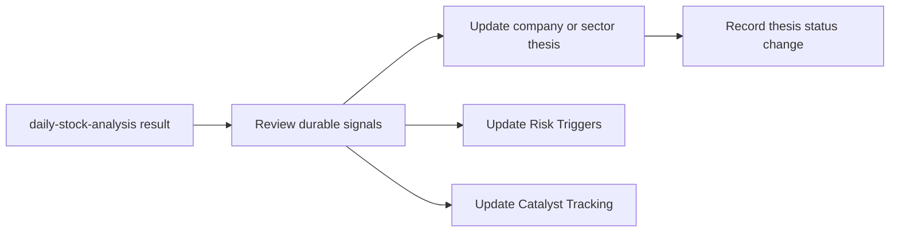

# Daily Analysis Bridge

## Summary

`daily-stock-analysis` 与 `trading-thesis` 的关系应当是：

- `daily-stock-analysis` 提供即时分析输入
- `trading-thesis` 负责长期结构化沉淀

前者回答“今天怎么看”，后者回答“长期 thesis 怎么演进”。

## Input Fields Available Today

当前 `daily-stock-analysis` 已能稳定提供这些字段：

- 股票代码 / 名称
- 技术指标
- 信号评分
- 趋势预测
- 操作建议
- 买入理由
- 风险提示
- 目标价 / 止损价（若 AI 返回）

这些字段已经足够用于 thesis 更新，但不应直接原样写成长期知识页。

## Bridge Rule

### A. 保持即时分析原子化

每日分析结果首先应被视为“观察样本”，而不是结论本身。

### B. 只提炼 durable signals

只有以下内容适合进入长期 thesis：

- 反复出现的风险信号
- 关键催化剂变化
- thesis 被强化或削弱的证据
- 结构性趋势变化

### C. 不把噪声直接写进 wiki

以下内容应谨慎处理，通常不应直接进入长期页：

- 单日情绪波动
- 短期噪声式买卖建议
- 缺少上下文的单次评分变化

## Suggested Update Flow

## Recommended Destinations

| Daily analysis output | Long-term destination |
|-----------------------|-----------------------|
| `risk_warning` | [[Risk Triggers]] or company thesis page |
| `buy_reason` | company thesis page / sector thesis page |
| `trend_prediction` | only if repeated and structurally meaningful |
| `operation_advice` | usually not durable by itself |
| `sentiment_score` | supporting signal, not thesis core |

## Related Pages

- [[Trading Thesis Framework]]
- [[Risk Triggers]]
- [[Catalyst Tracking]]
- [[Company Thesis Page]]
- [[Sector Thesis Page]]
